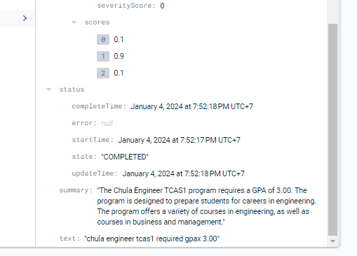
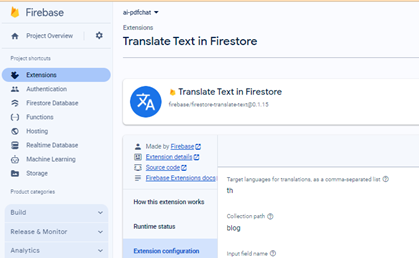
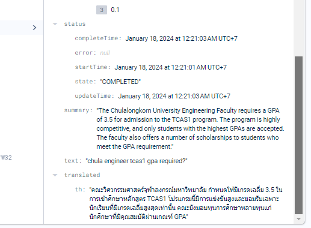
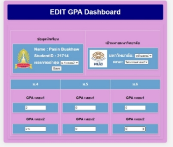
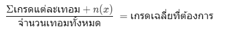
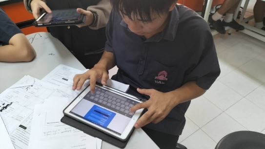

**โครงงานคอมพิวเตอร์ประเภทซอฟต์แวร์**

**เรื่อง ระบบเตรียมตัวสอบเข้ามหาวิทยาลัยและสืบค้นข้อมูลด้วยปัญญาประดิษฐ์**

**โดย**

`     `นายธนกร   มะลิวัลย์

`     `นายนภัทร  พงศ์คำ      

`     `นายพศิน  บัวขาว

ระดับชั้นมัธยมศึกษาตอนปลายโรงเรียนบดินทรเดชา (สิงห์ สิงหเสนี) ๒
สังกัดสำนักงานเขตพื้นที่การศึกษามัธยมศึกษา เขต ๒

**รายงานฉบับนี้เป็นส่วนประกอบของโครงงานประเภทซอฟต์แวร์
เนื่องในงานศิลปหัตถกรรมนักเรียน ครั้งที่ ๗๑ ปีการศึกษา ๒๕๖๖
ระดับ þเขต¨ ภาค
วันที่ ๑๕ มกราคม ๒๕๖๗**
ง

**โครงงานคอมพิวเตอร์ประเภทซอฟต์แวร์**

**เรื่อง ระบบเตรียมตัวสอบเข้ามหาวิทยาลัยและสืบค้นข้อมูลด้วยปัญญาประดิษฐ์**

**โดย**

`     `นายธนกร   มะลิวัลย์

`     `นายนภัทร  พงศ์คำ      

`     `นายพศิน  บัวขาว

ชั้นมัธยมศึกษาปีที่ 5

**ครูที่ปรึกษา**

`    `นางวิไล   สุขเกื้อ

`    `นางสาวศริยา   แก้วลายทอง

**โรงเรียนบดินทรเดชา (สิงห์สิงหเสนี) ๒**

**สังกัดสำนักงานเขตพื้นที่การศึกษามัธยมศึกษา เขต ๒**
**

`	`**บทคัดย่อ**
**

`	  `โครงงานคอมพิวเตอร์ “ระบบเตรียมตัวสอบเข้ามหาวิทยาลัยและสืบค้นข้อมูลด้วยปัญญาประดิษฐ์” 

มีแนวคิดมาจากการที่นักเรียนที่ต้องการวางแผนการสมัครเข้ามหาวิทยาลัย ที่จะมีอุปสรรคหากตอนยังไม่ได้เกรดทุกเทอม จะไม่สามารถคำนวณเปรียบเทียบกับเกณฑ์ของมหาวิทยาลัยว่าในเทอมที่เหลือความทำเกรดขั้นต่ำได้เท่าไร และปัญหาในการสืบค้นประกาศการรับสมัครเข้ามหาวิทยาลัยที่มีการเปลี่ยนแปลงทุกๆปีทำให้นักเรียนต้องสืบค้นข้อมูลจากหลายแหล่งและหลายเอกสาร หากมีหลายตัวเลือกของมหาวิทยาลัย และคณะ ดังนั้นผู้พัฒนาจึงริเริ่มโครงงานเพื่อเป็นการสร้างโปรแกรมที่จะอำนวยความสะดวกดังกล่าวในรูปแบบเว็ปไซต์ที่มีการเข้าสู่ระบบผ่าน อีเมล์ ผู้ใช้สามารถกรอกเกรดเพื่อเก็บข้อมูลได้ตลอดทำให้ได้เห็นความคืบหน้าของตนเองในแต่ละเทอม และยังมีระบบการสืบค้นด้วยปัญญาประดิษฐ์ที่เรียนรู้จากเอกสารของแต่ละมหาวิทยาลัยโดย จะแสดงผลเอกสารที่เกี่ยวข้องกับคำถามให้ไปศึกษาเพิ่มเติม และตอบกลับด้วยภาษามนุษย์

`	      `ผลจากการศึกษาค้นคว้าในโครงงานระบบเตรียมตัวสอบเข้ามหาวิทยาลัยและสืบค้นข้อมูลด้วยปัญญาประดิษฐ์ คือทำให้ผู้ใช้งานได้ตระหนักถึงความสำคัญของการวางแผนการทำเกรดของตนเองให้ผ่านเกณฑ์ขั้นต่ำของมหาวิทยาลัยเป้าหมายและสามารถวางแผนได้ง่ายรวดเร็วขึ้นจากระบบสืบค้นข้อมูลด้วยปัญญาประดิษฐ์	

วัตถุประสงค์ 

1) เพื่อพัฒนาโปรแกรมช่วยในการเตรียมตัวสอบเข้ามหาวิทยาลัย
1) นำเทคโนโลยีปัญญาประดิษฐ์มาใช้ในการช่วยจัดการข้อมูล
1) เพื่อประหยัดเวลาในการค้นหาข้อมูลเกรดเฉลี่ยที่ต้องการในแต่ละมหาวิทยาลัยได้

**กิตติกรรมประกาศ**

`	`โครงงานเรื่อง “ระบบเตรียมตัวสอบเข้ามหาวิทยาลัยและสืบค้นข้อมูลด้วยปัญญาประดิษฐ์” จะไม่สามารถสำเร็จลุล่วงได้เลยถ้าขาดการให้การสนับสนุนและอนุเคราะห์ในทุกๆมิติ จากสถานศึกษาตลอดจนผู้ที่เกี่ยวข้องทุกท่านดังต่อไปนี้ ขอขอบคุณ อาจารย์วิไล  สุขเกื้อและ อาจารย์ศริยา  แก้วลายทอง ที่ให้คำเสนอแนะ แนวคิดการออกแบบ ตลอดจนแก้ไขข้อบกพร่องมาโดยตลอดจนทำให้โครงงานสำเร็จลุล่วงไปด้วยดี 

ท้ายสุดนี้ผู้จัดทำหวังเป็นอย่างยิ่งว่า โครงงานนี้จะเป็นประโยชน์ต่อการศึกษาการพัฒนาโปรแกรมคอมพิวเตอร์ในรูปแบบอื่นๆ ของผู้สนใจต่อไป

`								`คณะผู้จัดทำ

**สารบัญ**

**เรื่อง											หน้า**

บทคัดย่อ										  ก

กิตติกรรมประกาศ									  ข

สารบัญ											  ค

บทที่ 1  บทนำ										  1

\-    ที่มาและความสำคัญของโครงงาน						  2

`	`-    วัตถุประสงค์									  2

`	`-    ขอบเขตของโครงการ							 	  2

`	`-    สถานที่ดำเนินการ								  2

`	`-    ผลที่คาดว่าจะได้รับ								  2	

บทที่ 2	เอกสารที่เกี่ยวข้อง								  3

บทที่ 3  อุปกรณ์และวิธีการดำเนินการ					                    10

บทที่ 4  ผลการดำเนินงาน								 14

บทที่ 5 	สรุปผลการดำเนินโครงการและข้อเสนอแนะ					 18

ข้อเสนอแนะ									           18

บรรณานุกรม										 19

ภาคผนวก										 20

9

**บทที่ 1**

**บทนำ**

**ที่มาและความสำคัญของโครงงาน**

การสอบเข้ามหาวิทยาลัยเป็นช่วงเวลาสำคัญในชีวิตของนักเรียนมัธยมปลายทุกคน นักเรียนทุกคนต่างก็มีความฝันอยากเข้าเรียนในมหาวิทยาลัยที่มีชื่อเสียงและสาขาวิชาที่ใฝ่ฝัน แต่การสอบเข้ามหาวิทยาลัยนั้นไม่ใช่เรื่องง่ายต้องใช้เวลาและความพยายามอย่างมากในการเตรียมตัวสอบ หนึ่งในนั้นคือการที่นักเรียนต้องคำนวณเกรดเฉลี่ย(GPAX)ด้วยตัวเองเพื่อตรวจสอบว่าเพียงต่อการสมัครแต่ละรอบหรือไม่ ซึ่งหากยังไม่ถึงเวลาของปีตนเองที่ยื่นก็จะไม่ทราบว่าในทราบว่าเทอมที่เหลือของระดับชั้นมัธยมปลายต้องทำเกรดให้ได้ขั้นต่ำเท่าใดถึงจะสามารถสมัครในมหาวิทยาลัย และคณะที่ต้องการได้ นอกจากนั้นยังเกี่ยวข้องกับการหาข้อมูลของแต่ละมหาวิทยาลัย และคณะที่ตนต้องการที่จะสมัครซึ่งในแต่ละปีเงื่อนไขของเอกสารจะมีการเปลี่ยนแปลงทำให้นักเรียนจำเป็นต้องค้นหาเอกสารของปีล่าสุด จึงจะทำให้นักเรียนต้องค้นหาข้อมูลหลายเอกสารหากตนเองได้สนใจที่จะสมัครมหาวิทยาลัย หรือคณะอื่นๆเป็นทางเลือกสำรอง

ด้วยปัญหาที่กล่าวมาข้างต้น ทางผู้พัฒนาโครงงาน”ระบบเตรียมตัวสอบเข้ามหาวิทยาลัยและสืบค้นข้อมูลด้วยปัญญาประดิษฐ์” จึงต้องการพัฒนาระบบที่สามารถประเมินเกรดของตนเองแบบต่อเนื่องในระดับชั้นมัธยมปลาย และสามารถเลือกเป้าหมายที่เป็นมหาวิทยาลัย และ คณะ เพื่อเปรียบเทียบเกรดเฉลี่ยตนเองกับเกณฑ์ขั้นตํ่าของแต่ละรอบพร้อมทั้งคำนวณว่าเกรดของเทอมที่ยังไม่ได้รับต้องทำให้ได้อย่างน้อยเท่าไรจึงจะได้เกรดเฉลี่ยที่ต้องการ และผู้ใช้งานสามารถสืบค้นเอกสารในการรับสมัครกับปัญญาประดิษฐ์ที่เรียนรู้จากประกาศการรับสมัครของแต่ละมหาวิทยาลัย ในรูปแบบการกรอกคำถามเพื่อสืบค้นโดยจะมีการตอบกลับเป็นภาษามนุษย์และระบบจะแสดงถึงเอกสารที่ปัญญาประดิษฐ์จำแนกว่าเกี่ยวข้องกับคำถามเพื่อให้ผู้ใช้งานได้ศึกษาเอกสารฉบับที่ต้องการได้สะดวกขึ้น

ดังนั้น คณะผู้จัดทำจึงสนใจทำโครงงานนี้ เพื่อเป็นระบบที่จะช่วยแนะแนวการทำเกรดเฉลี่ยให้เพียงพอต่อการสมัครระดับอุดมศึกษา และ ช่วยอำนวยความสะดวกในการสืบค้นประกาศการรับสมัครที่ตนสนใจด้วยปัญญาประดิษฐ์

** 

**วัตถุประสงค์**

1. เพื่อพัฒนาโปรแกรมช่วยในการเตรียมตัวสอบเข้ามหาวิทยาลัย
1. นำเทคโนโลยีปัญญาประดิษฐ์มาใช้ในการช่วยจัดการค้นหาข้อมูล
1. เพื่อประหยัดเวลาในการค้นหาข้อมูลเกรดเฉลี่ยที่ต้องการในแต่ละมหาวิทยาลัยได้

**ขอบเขตของโครงการ**

`	`พัฒนา  Web Application โดยมีเครื่องมือหรือโปรแกรมที่ใช้พัฒนาได้แก่

1\. เครื่องคอมพิวเตอร์พร้อมระบบเครือข่าย Internet

2\. Google Cloud Platform (GCP) account 

3\. Firebase เป็น PaaS ของ Google สำหรับการประมวลผลและเก็บข้อมูล

4\. Google Document AI ใช้ในการดึงข้อมูลออกจากไฟล์ pdf แบบรูปภาพ

5\. Google Vertex AI เป็นตัวช่วยจัดการการใช้ AI มาประมวลผลในงานด้านต่างๆ

6\. Search and Conversation เป็นตัวสร้าง application จากระบบ Vertex AI

7\. Google Cloud Storage สำหรับเก็บข้อมูลบนระบบ Cloud

8\. Firebase Authentication ชุดจัดการข้อมูลผู้ใช้งาน

9\. Firebase Firestore ระบบฐานข้อมูลแบบ NoSQL 

10\. Firebase hosting สำหรับให้บริการ Web application

**สถานที่ดำเนินการ**

โรงเรียนบดินทรเดชา (สิงห์ สิงหเสนี) ๒ เลขที่ 333 ถนนนวมินทร์ แขวงคลองกุ่ม เขตบึงกุ่ม 

กรุงเทพมหานคร 10240

**ผลที่คาดว่าจะได้รับ**

1. สามารถพัฒนา Application เพื่อช่วยสำหรับการเตรียมสอบเข้ามหาวิทยาลัย
1. ได้รับความรู้เกี่ยวกับการประยุกต์ใช้ AI มาช่วยในการทำงานแบบต่างๆ

**บทที่2**

**เอกสารที่เกี่ยวข้อง**

ในการจัดโปรแกรม “ระบบเตรียมตัวสอบเข้าอุดมศึกษาและสืบค้นข้อมูลด้วยปัญญาประดิษฐ์” คณะผู้จัดทำได้ทำการศึกษา ค้นคว้าข้อมูล และ เตรียมทรัพยากรที่ใช้ในการพัฒนาระบบดังนี้ ดังนี้

1. ระบบการคัดเลือกกลางบุคคลเข้าศึกษาในสถาบันอุดมศึกษา ปีการศึกษา 2567
1. ข้อมูลการเตรียมตัวสำหรับสอบเข้าระดับอุดมศึกษา
1. ภาษาคอมพิวเตอร์ที่ใช้ในการพัฒนา HTML, CSS, JavaScript และ Node.js
1. Generative AI : LLMs in text summarization
1. Google Cloud Platform (GCP) console
1. Google Firebase console 
1. Search and Conversation on Vertex AI
1. Google AI Document
1. Firebase Extension : Summarize Text with PaLM API 
1. Firebase Extension : Translate Text in Firestore

1. **ระบบการคัดเลือกกลางบุคคลเข้าศึกษาในสถาบันอุดมศึกษา ปีการศึกษา 2567**

การรับบุคคลเข้าศึกษาในสถาบันอุดมศึกษาในประเทศไทย เป็นระบบการรับสมัครบุคคลที่จบการศึกษาระดับชั้นมัธยมศึกษาตอนปลายหรือเทียบเท่า และคัดเลือกเพื่อเข้าศึกษาในสถาบันอุดมศึกษา ซึ่งในปัจจุบันเป็นการใช้ระบบ TCAS (Thai university Central Admission System) ซึ่งใช้มาตั้งแต่ปีการศึกษา 2561 แบ่งเป็น แบบที่1 แฟ้มสะสมผลงาน (Portfolio) แบบที่2 โควตา (Quota) แบบที่3 รับตรงร่วมกัน (Admission 1) แบบที่4 รับกลางร่วมกัน (Admission 2) แบบที่5 รับตรงอิสระ (Direct Admission) URL: <https://www.mytcas.com/>

    

1. **การเตรียมตัวสำหรับสอบเข้าระดับอุดมศึกษา**

การเตรียมตัวสอบระบบTCAS ในปัจจุบัน จำเป็นต้องมาการเตรียมความพร้อมตั้งแต่เนิ่นๆ โดยมีข้อมูลที่จำเป็นขั้นต่ำสุดต้องใช้ในการวางแผนคือ สาขาวิชาและมหาวิทยาลับที่ต้องการศึกษาต่อ ผลการเรียนเฉลี่ยสะสม(GPAX) และ รูปแบบการสมัครทีต้องการ โดยจะมีรายละเอียดดังนี้

- สาขาวิชาและมหาวิทยาลัยที่เลือก จะมีผลต่อการเตรียมตัวรายวิชาที่ใช้สอบ และผลการเรียนเฉลี่ยสะสม ขั้นต่ำที่ต้องใช้ในการสมัคร
- ผลการเรียนเฉลี่ยสะสม โดยส่วนมากจะใช้ผลการเรียนเฉลี่ยสะสม5เทอม (ม.4 – ม.6 เทอม1) ซึ่งถ้าหากไม่ได้วางแผนไว้แต่ค้น การทำเกรดเฉลี่ยสะสมเพื่อให้ผ่านเกณฑ์ขั้นต่ำที่สามารถสมัครได้ในมหาวิทยาลัยที่ต้องการ หากมีเกรดเฉลี่ยไม่เพียงพอก็จะไม่สามารถสมัครได้
- รูปแบบการสมัคร ในการสมัคร TCAS ในแต่ละรอบจะมีรายละเอียดแตกต่างกันทั้งรูปแบบและรายละเอียดความต้องการของแต่ละมหาวิทยาลัย รวมไปถึงในแต่ละปีการศึกษาด้วย
1. **ภาษาคอมพิวเตอร์ที่ใช้ในการพัฒนา HTML, CSS, JavaScript และ Node.js**

   กลุ่มภาษาคอมพิวเตอร์ที่ใช้ในการเขียนโปรแกรมในส่วน Web application เพื่อติดต่อกับผู้ใช้งาน

ภาษา HTML+CSS <https://www.w3schools.com/html/html_css.asp>

ภาษา JavaScript   <https://developer.mozilla.org/en-US/docs/Web/JavaScript>

คู่มือ Node.js   <https://nodejs.org/docs/latest/api/>

คู่มือการใช้งาน Firebase CLI   <https://firebase.google.com/docs/cli>

1. **Generative AI : LLMs in text summarization**

   Generative AI เป็นสาขาหนึ่งของระบบปัญญาประดิษฐ์ที่จะเน้นการ “สร้างใหม่” จากชุดข้อมูลที่มีอยู่ โดยมีการใช้ Generative model ในแบบต่างๆตามงานที่เกี่ยวข้อง

LLM (Large Language Model) คือ deep learning โมเดลภาษาขนาดใหญ่ที่ได้รับการสร้างจากข้อมูลทางภาษาจำนวนมาก โดนทำการแตกข้อมูลจากกลุ่มคำ ออกมาเป็นข้อมูลแบบเวกเตอร์หลายมิติ เพื่อให้สามารถหาคำที่เกี่ยวข้องหรือมีความหมายตามบริบทตรงกัน โดยในโครงงานนี้จะใช้ Model ที่ทาง Google จัดเตรียมไว้ให้ ชื่อว่า PaLM 2 ซึ่งถูกพัฒนาต่อเนื่องมาจาก Machine Learning และ Responsible AI ที่มีการควบคุมคำตอบที่มีความรับผิดชอบต่อสังคม 

ในขณะที่มีการพัฒนาโปรแกรมนี้ ทาง Google ได้เปิดตัว Model ใหม่ชื่อว่า Gemini ซึ่งอยู่ในกลุ่มของ Generative AI โดยตรงและทำงานแบบ multimodel คือสามารถจัดการข้อมูลได้จากสื่อหลายๆรูปแบบเช่นตัวหนังสือ ภาพนิ่ง หรือไฟล์วิดีโอ

Generative AI: <https://cloud.google.com/vertex-ai/docs/generative-ai/learn-resources>

Text summarization เป็นการใช้เทคโนโลยีปัญญาประดิษฐ์ ในการกลั่นกรองข้อความ เอกสาร หรือกลุ่มคำให้สั้นลงและเข้าใจง่าย เช่นการอ่านไฟล์ PDF ทั้งหน้าและสรุปใจความสำคัญออกมาเป็นประโยคสั้นๆ

AI Summarization: <https://cloud.google.com/use-cases/ai-summarization>

1. **Google Cloud Platform (GCP) console**

   

Google Cloud Console เป็นส่วนจัดการการใช้ ฟังชั่นต่างๆที่ Google จัดเตรียมให้

จะสามารถเข้าถึงการจัดการในส่วนงาน “Search and Conversation on Vertex AI” และ

“Google Document AI” ได้

Google Cloud Platform: <https://console.cloud.google.com/>

1. **Google Firebase console**

   

Firebase เป็น Platform as a Service (PaaS) จาก Google ที่แยกออกมาจาก GCP

จะเข้าถึงการจัดการในส่วนงาน “Authentication”, “Hosting”, “Firestore Database”, “Firebase Extension: Summarize Text with PaLM API” และ 

“Firebase Extension: Translate Text in Firestore”

Firebase console: <https://console.firebase.google.com/>

1. **Search and Conversation on Vertex AI**

   

Search and Conversation จะมีการทำงานโดยเริ่มจากการนำข้อมูลเข้าจากไฟล์ PDF และ extract text ออกมาโดยใช้ OCR AI และทำการแยกข้อมูลเป็น vector data 

Search on Vertex AI: <https://cloud.google.com/vertex-ai-search-and-conversation>

1. **Google Document AI**

   

Google Document AI จะทำการใช้เทคนิค OCR ในการแปลง Image เป็น Text และทำการ extract text ที่ได้สำหรับส่งไปใช้งานในโปรแกรมอื่นต่อไป

Document AI: <https://cloud.google.com/document-ai>

1. **Firebase Extension : Summarize Text with PaLM API**

Extension นี้ จะทำงานโดยตรงใน Firestore Database โดยจะรอรับค่า Input เข้าไปใน field text หลังจากนั้นจะทำการสรุปออกมาใน field summary

URL: <https://extensions.dev/extensions/googlecloud/firestore-palm-summarize-text>

1. ` `**Firebase Extension : Translate Text in Firestore**

Extension นี้ จะทำงานโดยตรงใน Firestore Database โดยจะใช้ค่าจาก field summary ที่เป็นภาษาอังกฤษและทำการแปลออกมาเป็นรูปแบบภาษาไทย ใน field translate

URL: <https://extensions.dev/extensions/firebase/firestore-translate-text>

**บทที่ 3**

**อุปกรณ์และวิธีการดำเนินการ**

**3.1 เครื่องมือ วัสดุ อุปกรณ์**

1. เครื่องคอมพิวเตอร์พร้อมระบบเครือข่าย Internet
1. Google Cloud Platform (GCP) account สำหรับใช้ทรัพยากรบนระบบ Cloud
1. โปรแกรมในกลุ่ม Fierbase ใช้ในการจัดการข้อมูลและแสดงผล
1. โปรแกรมในกลุ่ม Vertex AI สำหรับใช้ประมวลผลด้าน AI

**3.2 ขั้นตอนการดำเนินงาน**

1\. คิดหัวข้อโครงงาน

2\. ศึกษาข้อมูลที่จำเป็นกับการพัฒนาโครงงาน

3\. ออกแบบระบบการสมัครสมาชิกและทำการเข้าสู่ระบบ

4\. ออกแบบระบบการแสดงผล GPAX และการแก้ไขข้อมูล GPAX ของผู้ใช้งาน

5\. ออกแบบระบบการค้นหาข้อความจากเอกสาร PDF

`	`6. ทดสอบการทำงานของโปรแกรมทั้งระบบ

7\. นำเสนอความก้าวหน้าของโครงการให้ครูที่ปรึกษา

8\. จัดทำเอกสารโครงงาน

9\. นำเสนอโครงงานและนำไปใช้

3. **แผนผังการทำงานของโปรแกรม**

แผนผังการทำงานของโครงงาน

**3.4 ตัวอย่างของโปรแกรม(เอารูปใส่)**

`         `

หน้าลงทะเบียน

หน้าเข้าสู่ระบบ

![ref1]

หน้าจอแสดงผล

หน้าจอสืบค้นข้อมูล

![ref2]

แนะนำหน้าจอแสดงผล

![ref3]

แนะนำสืบค้นข้อมูล

**บทที่ 4**

**ผลการดำเนินงาน**

การดำเนินงานของโครงงาน ระบบเตรียมตัวสอบเข้ามหาวิทยาลัยและสืบค้นข้อมูลด้วยปัญญาประดิษฐ์ มีผลการดำเนินงาน 3 ประการ ดังนี้

1\.การบันทึกเกรดเฉลี่ยแต่ละเทอมเพื่อคำนวณเป้าหมายเกรดเทอมถัดไปให้เพียงพอต่อเกณฑ์ของมหาวิทยาลัยที่เป็นเป้าหมาย

2\.ระบบการสืบค้นข้อมูลการรับเข้าศึกษาต่อของมหาวิทยาลัย

3\.แบบสำรวจการเตรียมตัวเข้ามหาวิทยาลัยและการทดลองใช้งานโปรแกรม

**1.การบันทึกเกรดเฉลี่ยแต่ละเทอมเพื่อคำนวณเป้าหมายเกรดเทอมถัดไปให้เพียงพอต่อเกณฑ์ของมหาวิทยาลัยที่เป็นเป้าหมาย**

1\. ผู้ใช้งานที่เข้าสู่ระบบต้องเลือกจำนวนเกรดที่มีในช่อง “ผลเกรดล่าสุด”และกรอกข้อมูลเกรดแต่ละเทอมให้ตรงกับจำนวนเทอมที่เลือกไว้ หากไม่ตรงกันระบบจะแจ้งเตือนให้กรอกใหม่อีกครั้ง พร้อมทั้งเลือกมหาวิทยาลัยและคณะเป้าหมายที่จะเปรียบเทียบกับเกณฑ์ขั้นต่ำในการรับสมัคร และกดบันทึก

![ref4]

2\.ระบบแสดงผลของผู้ใช้งานทั้งชื่อเลขที่ประจำตัวและเกรดเฉลี่ยสะสมของปัจจุบัน และแสดงเป้าหมาย มหาวิทยาลัย และ คณะที่ถูกเลือกไว้ ในตารางจะแบ่งการแสดงเกรดแต่ละเทอมเป็นชั้นปี ข้อมูลที่ผู้ใช้งานกรอกจะอยู่ด้านซ้ายเป็น ตัวอักษรสีขาว และ ข้อมูลคำนวณเกรดขั้นต่ำในเทอมถัดไปจะอยู่ด้านขวา ตัวอักษรสีดำ ซึ่งจะคำนวณจะเกณฑ์ของมหาวิทยาลัยที่เลือกไว้จะอยู่ในตารางคอลัมน์TCASที่จะแดงเกณฑ์ของแต่ละรอบ และมีการรายงานว่าเกรดเฉลี่ยที่มีอยู่จะสามารถสมัครรอบนั้นได้หรือไม่ โดยจะคำนวณตามสมการดังนี้

`                                 `***เมื่อกำหนดให้*** 

`                                           `***x = เกรดขั้นต่ำในเทอมถัดไป*** 

`                                           `***n=จำนวนเทอมที่ยังเหลืออยู่***

`                                          `***เกรดของเทอมที่ยังไม่ได้รับ = 0***

**2.ระบบการสืบค้นข้อมูลการรับเข้าศึกษาต่อของมหาวิทยาลัย**

1\.ผู้ใช้งานสามารถสืบค้นได้ที่แถบด้านขวาของเว็ปไซต์ที่มีการสืบค้นด้วยปัญญาประดิษฐ์ 

2\.ผู้ใช้งานสามารถสืบค้นแล้วระบบทำการแสดงเอกสารที่เกี่ยวข้องและอ้างอิงจากข้อมูลที่ใกล้เคียงที่สุดนำมาตอบเป็นภาษามนุษย์ ซึ่งผู้ใช้งานจะสามารถคลิกไปที่ไฟล์เอกสารเพื่อศึกษาต่อด้วยตนเองได้

**3.แบบสำรวจการเตรียมตัวเข้ามหาวิทยาลัยและการทดลองใช้งานโปรแกรม**

**บทที่ 5**

**สรุปผลการดำเนินงาน**

โครงงานเรื่อง ระบบเตรียมตัวสอบเข้ามหาวิทยาลัยและสืบค้นข้อมูลด้วยปัญญาประดิษฐ์  มีวัตถุประสงค์เพื่อ

1\.เพื่อพัฒนาโปรแกรมช่วยในการเตรียมตัวสอบเข้ามหาวิทยาลัย

2\.นำเทคโนโลยีปัญญาประดิษฐ์มาใช้ในการช่วยจัดการข้อมูล

3\.เพื่อประหยัดเวลาในการค้นหาข้อมูลเกรดเฉลี่ยที่ต้องการในแต่ละมหาวิทยาลัยได้

**สรุปผล** 

1\. ผู้ใช้งานตระหนักถึงความสำคัญของเกรดเฉลี่ย และค้นหาข้อมูลของมหาวิทยาลัยต่างๆ 

2\. ระบบสามารถช่วยอำนวยความสะดวกในการสืบค้นข้อมูลการรับสมัครของมหาวิทยาลัย

3\.ทำให้ผู้ใช้งานทราบว่าต้องทำเกรดเฉลี่ยในเทอมที่เหลือเท่าไรจึงจะเพียงพอต่อการสมัคร

**อภิปรายผล**

` 	`จากการศึกษาค้นคว้าโครงงานระบบเตรียมตัวสอบเข้ามหาวิทยาลัยและสืบค้นข้อมูลด้วยปัญญาประดิษฐ์ ทำให้สามารถนำความรู้ทางด้านการพัฒนาเว็ปไซต์และการใช้งานปัญญาประดิษฐ์ในการจัดทำระบบการเตรียมตัวและการสืบค้นเอกสารการสมัครเข้ามหาวิทยาลัย ทำให้ผู้ใช้งานสามารถวางแผนในการทำเกรดเฉลี่ยและสืบค้นการรับสมัครให้ตรงกับเป้าหมายของตนเอง ทำให้สามารถอำนวยความสะดวกด้านเวลาในการสืบค้นและการประเมินตนเอง

**ข้อเสนอแนะ** 

1. ควรเพิ่มการประเมินผลการเรียนเฉพาะกลุ่มสาระ สำหรับบางคณะที่ต้องการเกรดแค่เฉพาะรายวิชา

2\.   การประเมินเกรดเฉลี่ยตามรายวิชาที่มีหน่วยกิตแตกต่างกันออกๆไป

**บรรณานุกรม**

MyTCAS. (n.d.).ระบบ MyTcas. สืบค้นจาก https://www.mytcas.com/

คณะวิทยาศาสตร์ มหาวิทยาลัยขอนแก่น. (n.d.).Cloud Computing คืออะไร?. สืบค้นจาก https://sc2.kku.ac.th/office/sci-it/index.php/29-cloud-computing.html

Aigen Corporation. (2023, November 17). Generative AI คืออะไร? ทำอะไรได้บ้าง?. สืบค้นจาก https://aigencorp.com/what-is-generative-ai/

Visai AI. (2023, January 11). OCR (Optical Character Recognition) คืออะไร?. สืบค้นจาก https://visai.ai/th/blogs/9/ocr-data-extraction

Blognone. (2023, December 28). 5 เทรนด์ AI ปี 2566 ที่น่าจับตามอง. สืบค้นจาก https://www.blognone.com/node/116814

True Digital Group. (n.d.). รู้จักอนาคต AI ในรูปแบบ Multimodal AI ทำงานได้กับข้อมูลหลายประเภท. สืบค้นจาก https://www.truedigital.com/post/

**ภาคผนวก**

![ref5]

![ref6]

[ref1]: Aspose.Words.0e242c37-d363-46dc-a478-d7a5c0ba85d0.014.png
[ref2]: Aspose.Words.0e242c37-d363-46dc-a478-d7a5c0ba85d0.016.png
[ref3]: Aspose.Words.0e242c37-d363-46dc-a478-d7a5c0ba85d0.017.png
[ref4]: Aspose.Words.0e242c37-d363-46dc-a478-d7a5c0ba85d0.019.png
[ref5]: Aspose.Words.0e242c37-d363-46dc-a478-d7a5c0ba85d0.024.png
[ref6]: Aspose.Words.0e242c37-d363-46dc-a478-d7a5c0ba85d0.026.png
